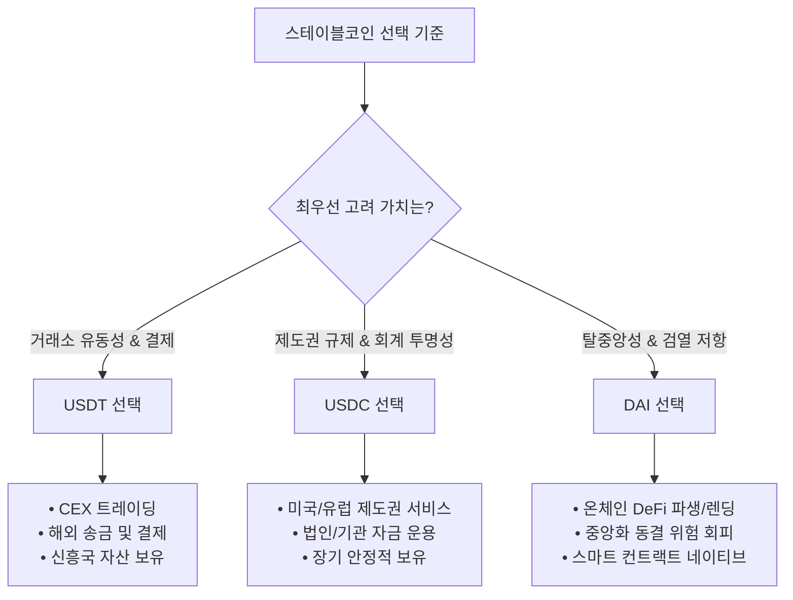

# 스테이블코인 3대장 (USDT, USDC, DAI) 심층 비교 분석 보고서

> 본 문서는 대표적인 글로벌 스테이블코인인 **USDT(Tether)**, **USDC(Circle)**, **DAI(MakerDAO/Sky)**의 담보구조, 투명성, 시장규모, 규제 리스크, 기술적 안정성을 객관적으로 비교 분석한 자료입니다.

---

## 1. 핵심 요소 종합 비교표

| 비교 항목 | USDT (Tether) | USDC (Circle) | DAI (MakerDAO / Sky) |
| :--- | :--- | :--- | :--- |
| **발행 방식 / 유형** | 중앙화 법정화폐 담보형 | 중앙화 제도권 법정화폐 담보형 | 탈중앙화 가상자산/RWA 과담보형 |
| **주요 담보 자산** | 미국 단기 국채(75~85%), 현금/예금, 비트코인, 금, 담보대출 등 | 미국 단기 국채(BlackRock 운용 펀드) 및 지정 은행 현금 예치금 (100%) | 암호화폐(ETH, WBTC 등) + RWA(미 국채 등) + PSM(USDC 등) |
| **투명성 & 감사** | 분기별 회계법인(BDO) **증명(Attestation)** 보고서 공개 | 월별 회계법인(Deloitte) **증명** 및 정기 감사 보고서 공개 | 온체인 스마트 컨트랙트로 **24/7 실시간 100% 공개** |
| **시장 점유율 & 유동성** | **압도적 1위** (전체 시장 65~70% 점유)<br>CEX 및 글로벌 실물 결제/송금 지배 | **2위** (전체 시장 약 20% 내외 점유)<br>DeFi 및 미국 제도권/기관 금융 주도 | **탈중앙화 1위** (전체 시장 3~4위권)<br>DeFi 대출, 파생상품 및 담보 자산 주도 |
| **규제 리스크** | **높음**<br>오프쇼어 운영, 미 당국 감시, EU MiCA 규제 충돌 | **낮음**<br>미국 규제 준수, EU MiCA 라이선스 취득 등 제도권 편입 | **중간**<br>DAO 기반이나 담보 내 USDC/RWA 포함으로 간접 규제 노출 |
| **검열 및 동결 권한** | 중앙화 블랙리스트(주소 동결) 기능 보유 | 중앙화 블랙리스트(주소 동결) 기능 보유 (OFAC 제재 적극 준수) | 스마트 컨트랙트 자체는 동결 불가<br>(단, 담보 USDC 동결 위험 상존) |
| **핵심 리스크 요인** | 준비금 세부 정보 불투명성, 규제 제재 시 유동성 경색 | 전통 은행 시스템 의존(뱅크런 리스크), 규제 검열 | 스마트 컨트랙트 취약점, 담보 자산 급락 시 연쇄 청산/디페그 |

---

## 2. 담보 구조 및 자산 건전성 (Collateral Structure)

```
[담보 구조 비교]

USDT: [ 미국 단기 국채 (~80%) ] + [ 현금/예금 ] + [ 비트코인/금/담보대출 (위험자산 일부) ]
USDC: [ Circle Reserve Fund (BlackRock 운용 초단기 국채/Repo) ] + [ 공인 은행 현금 (100%) ]
DAI : [ ETH/WBTC 과담보 (CDP) ] + [ PSM (USDC 등 1:1 교환 풀) ] + [ RWA (실물 국채 투자) ]
```

### 1) USDT (Tether)
* **구성**: 미국 단기 국채(U.S. Treasury Bills) 비중이 약 75~85% 수준으로 가장 크며, 나머지는 역환매조건부채권(Reverse Repo), 은행 예금, 비트코인(BTC), 귀금속(금), 담보대출(Secured Loans)로 구성.
* **특징**: 과거 논란이 되었던 상업어음(Commercial Paper)을 전액 청산하고 국채 비중을 대폭 늘려 건전성을 개선함. 그러나 비트코인 및 대출 채권 등 시장 변동성에 노출된 자산이 준비금에 일부 포함되어 있음.

### 2) USDC (Circle)
* **구성**: 100% 현금 및 만기 90일 이하의 초단기 미국 국채.
* **특징**: 준비금의 약 80~90%는 세계 최대 자산운용사인 **블랙록(BlackRock)**이 관리하는 SEC 등록 정부 MMF인 **Circle Reserve Fund(USDXX)**에 보관되며, 나머지 현금은 BNY Mellon 등 공인 금융기관에 분산 예치됨. 자산 건전성 측면에서 가장 보수적이고 안전함.

### 3) DAI (MakerDAO / Sky)
* **구성**: 다중 담보 모델(Multi-Collateral DAI). 온체인 암호화폐(ETH, stETH, WBTC 등 과담보 130~150% 이상) + PSM(Peg Stability Module 내 USDC) + RWA(미국 국채 투자 신탁).
* **특징**: 시장 변동성에 대응하기 위해 과담보 방식을 취하며, 가격 안정성을 높이기 위해 법정화폐 담보 스테이블코인(USDC)과 전통 금융 자산(RWA)을 적극 포트폴리오로 편입함.

---

## 3. 투명성 및 감사 체계 (Transparency & Audit)

### 1) USDT: 제한적 제3자 증명 (Attestation)
* **방식**: 글로벌 회계법인 **BDO Italia**를 통해 분기별 준비금 증명(Attestation Report)을 발행.
* **한계**: 회계 감사의 정석인 'Full Audit(전면 재무제표 감사)'이 아니며, 특정 시점(Snapshot)의 잔액만 확인하는 형태. 구체적인 은행 계좌 위치나 파트너십 내역 등은 영업 비밀을 이유로 비공개.

### 2) USDC: 최고 수준의 제도권 공시
* **방식**: 글로벌 4대 회계법인 **딜로이트(Deloitte)**를 통해 매월 독립적 제3자 증명 보고서를 발행.
* **특징**: 미 증권거래위원회(SEC) 등록 수준의 회계 기준을 충족하며, 준비금 CUSIP 번호(채권 고유 식별 번호)까지 상세히 공시하여 신뢰도가 매우 높음.

### 3) DAI: 온체인 100% 실시간 투명성
* **방식**: 이더리움 블록체인 스마트 컨트랙트를 통해 모든 담보 예치, 청산 수치, 발행량이 24시간 실시간 공개.
* **특징**: 제3자 회계법인의 신뢰에 의존할 필요 없이, 누구나 온체인 대시보드([daistats.com](https://daistats.com), [makerburn.com](https://makerburn.com))를 통해 실시간 검증 가능.

---

## 4. 시장 규모 및 생태계 점유율 (Market Share & Ecosystem)

```
[시장 점유율 개략]
■■■■■■■■■■■■■■■■■■■■■■■■■■■■ USDT (~68%)
■■■■■■■■ USDC (~22%)
■■ DAI / USDS (~3.5%)
■ 기타 (FDUSD, PYUSD 등) (~6.5%)
```

### 1) USDT: 독점적 글로벌 유동성 (The King of Liquidity)
* 바이낸스, 바이비트, OKX 등 글로벌 CEX 내 선물 및 현물 거래 쌍의 약 70% 이상을 점유.
* 동남아, 남미, 아프리카, CIS 등 신흥국에서 자국 통화 인플레이션 헤지, P2P 결제, 국경 간 송금의 사실상 표준 기축 통화.

### 2) USDC: 제도권 금융 및 DeFi의 표준 (Institutional Standard)
* 미국 기관 투자자, 전통 핀테크(Visa, Stripe, PayPal 등), 코인베이스(Coinbase) 생태계 중심.
* DeFi 프로토콜 내에서 가장 신뢰받는 기축 담보 자산으로 사용됨.

### 3) DAI: 무허가성 DeFi 생태계의 기축 (Decentralized Core)
* Aave, Compound, MakerDAO, Curve 등 핵심 DeFi 프로토콜에서 무허가형(Permissionless) 금융 서비스의 기축 통화 역할 수행.

---

## 5. 규제 컴플라이언스 및 검열 저항성 (Regulatory & Censorship)

### 1) USDT: 높은 오프쇼어 규제 위험
* 영국령 버진아일랜드(BVI) 및 엘살바도르 등에 기반을 둔 오프쇼어 모델.
* 미 법무부(DOJ), FinCEN 등의 조사를 지속적으로 받아옴.
* **유럽 MiCA(가상자산시장법)** 규격을 맞추지 못해 유럽 거래소 내 USDT 거래 지원 중단/제한 압박을 받고 있음.

### 2) USDC: 완벽한 제도권 규제 친화성
* 미국 FinCEN 등록, 미국 48개 이상 주 송금업 라이선스 보유, **EU MiCA 전자화폐기관(EMI) 라이선스 최초 취득**.
* 미국 정부 및 사법 당국의 법적 명령(OFAC 제재 목록)에 따라 특정 지갑 주소를 즉각 블랙리스트/동결 조치함 (예: Tornado Cash 컨트랙트 차단).

### 3) DAI: 탈중앙 거버넌스와 간접 규제 노출
* 특정 국가의 라이선스를 받지 않는 DAO(MakerDAO) 구조로 운영되며, 프로토콜 자체는 주소 동결 권한이 없음.
* 그러나 담보 자산 중 USDC 및 미 국채(RWA) 비중이 높아, 배후 담보 자산이 정부 규제에 의해 동결될 경우 프로토콜이 타격을 입을 수 있는 간접적 규제 리스크가 존재함.

---

## 6. 기술적 안정성 및 과거 디페깅(Depeg) 분석

```
[역대 주요 디페깅 이벤트]

1. 2022년 5월 테라-루나 사태:
   USDT: 시장 패닉으로 순간 $0.95 하락 ───> 100억 달러 1:1 전액 상환 증명 ───> $1.00 복귀

2. 2023년 3월 실리콘밸리은행(SVB) 뱅크런 사태:
   USDC: 준비금 33억 달러 동결 우려 ───> $0.87까지 폭락 ───> 연준 전액 보증 ───> $1.00 복귀
   DAI : 담보 USDC 디페그 영향 전이 ───> $0.88 동반 폭락 ───> USDC 안정화 후 ───> $1.00 복귀
```

### 1) USDT: 시장 패닉 회복력 입증
* **기술 메커니즘**: ERC-20, TRC-20, Solana 등 다중 체인 스마트 컨트랙트 배포 (중앙 관리자 키로 주소 동결/소각 가능).
* **사례**: 2022년 루나 붕괴 당시 USDT에 대한 대규모 매도세로 $0.95까지 하락했으나, 테더사가 1주일 동안 약 100억 달러 이상의 1:1 법정화폐 환매(Redemption) 요구를 무결점으로 처리하며 신뢰를 회복함.

### 2) USDC: 전통 은행 뱅크런 전염 리스크
* **기술 메커니즘**: ERC-20 등 다수 체인 지원 (FiatTokenProxy 컨트랙트를 통해 블랙리스트 및 컨트랙트 업그레이드 지원).
* **사례**: 2023년 3월 SVB(실리콘밸리은행) 파산 당시 준비금 중 33억 달러가 묶였다는 발표로 온체인 유동성 풀에서 패닉 매도가 발생하여 **$0.87까지 급락**. 이후 미 정부의 예금 전액 보호 조치 발표 후 1달러로 정상 복원됨.

### 3) DAI: 스마트 컨트랙트 및 연쇄 디페깅 리스크
* **기술 메커니즘**: Maker Core 스마트 컨트랙트 세트 (Vat, Jug, Spot, Dog, Clipper 등 담보 대출 및 청산 자동화 엔진).
* **사례**: 2023년 3월 SVB 사태 당시, DAI의 페그 안정화 모듈(PSM)에 예치된 자산이 대부분 USDC였던 탓에 **DAI 역시 $0.88까지 동반 추락**. 이후 MakerDAO는 USDC 의존도를 낮추고 국채 RWA를 다변화하는 'Endgame Plan'을 실행하게 됨.

---

## 7. 상황별 선택 및 활용 가이드



### 최종 요약
1. **USDT**: *“가장 유동성이 풍부하고 어디서나 쓰이지만, 오프쇼어 규제 위험과 불투명성을 감수해야 하는 코인”*
2. **USDC**: *“전통 금융 및 규제 기관과 가장 긴밀히 연결된 최고 수준의 안전자산이나, 중앙화 검열에 취약한 코인”*
3. **DAI**: *“중앙 주체의 임의 동결이 불가능한 온체인 탈중앙 통화이나, 스마트 컨트랙트 및 담보 복합 리스크를 지닌 코인”*

---

## 8. 공식 1차 자료 및 참고 링크 (Official References)

### 1) 🟢 USDT (Tether)
* **준비금 증명 보고서 (Transparency Hub)**: [tether.to/en/transparency](https://tether.to/en/transparency/) — *BDO 분기별 증명 보고서 및 체인별 발행량*
* **작동 원리 (How Tether Works)**: [tether.to/en/how-it-works](https://tether.to/en/how-it-works/) — *1:1 담보 메커니즘 개요*
* **초기 백서 (Original Whitepaper)**: [tether.to/en/whitepaper](https://tether.to/en/whitepaper/) — *역사적 참조용 원본 백서*
* **이용 약관 및 법적 정책 (Legal Terms)**: [tether.to/en/legal](https://tether.to/en/legal/) — *환매 요건 및 지갑 동결 정책*

### 2) 🔵 USDC (Circle)
* **준비금 투명성 및 감사 보고서 (Circle Transparency)**: [circle.com/en/transparency](https://www.circle.com/en/transparency) — *Deloitte 월별 검증 보고서 및 국채 보유 내역*
* **블랙록 준비금 펀드 (BlackRock USDXX)**: [blackrock.com/circle-reserve-fund](https://www.blackrock.com/cash/en-us/products/329365/circle-reserve-fund) — *준비금 MMF 일별 포트폴리오 공시*
* **공식 제품 소개 (USDC Overview)**: [circle.com/en/usdc](https://www.circle.com/en/usdc) — *규제 라이선스(MiCA 등) 및 서비스 안내*
* **개발자 기술 문서 (Circle Developer Docs)**: [developers.circle.com](https://developers.circle.com/) — *스마트 컨트랙트 및 크로스체인 전송 프로토콜(CCTP)*

### 3) 🟡 DAI (MakerDAO / Sky Protocol)
* **공식 백서 (Maker Protocol Whitepaper)**: [makerdao.com/en/whitepaper](https://makerdao.com/en/whitepaper/) — *MCD 시스템 및 청산/수수료 수학 모델*
* **스마트 컨트랙트 개발자 문서 (Maker Docs)**: [docs.makerdao.com](https://docs.makerdao.com/) — *Vat, Dog, PSM 등 코어 컨트랙트 아키텍처*
* **실시간 온체인 대시보드 (DaiStats)**: [daistats.com](https://daistats.com/) — *24/7 실시간 담보 비율 및 부채 현황*
* **담보 구성 및 수익 대시보드 (Makerburn)**: [makerburn.com](https://makerburn.com/) — *담보별(ETH, USDC, RWA) 구성비 및 프로토콜 수익*
* **거버넌스 포털 (MakerDAO Governance)**: [vote.makerdao.com](https://vote.makerdao.com/) — *담보 추가 및 파라미터 투표 포털*
* **Sky 프로토콜 포털 (Next Maker)**: [sky.money](https://sky.money/) — *Endgame 업그레이드 및 USDS/SKY 전환 안내*

