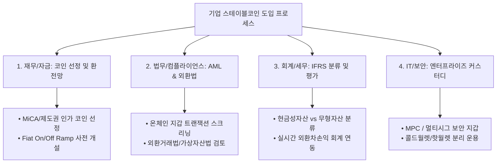

# 글로벌 주요 기관의 스테이블코인 리서치 종합 분석 및 기업 도입 가이드

> 본 문서는 `reports/` 폴더에 수록된 글로벌 국제금융기구(FSB, BIS, IMF), 주요국 중앙은행 및 정부(미 연준, 백악관 PWG, ECB), 글로벌 투자은행(Citi GPS)의 공식 원문 보고서 7편을 종합 분석하고, 보고서들이 제시하는 핵심 리스크 요인과 기업(법인)의 스테이블코인 도입 실무 체크리스트를 정리한 리서치 자료입니다.

---

## 1. 수록 보고서 목록 및 개요 (Reports Inventory)

| 파일명 | 발간 기관 | 보고서명 | 발간 연도 | 핵심 분야 |
| :--- | :--- | :--- | :--- | :--- |
| **`P170723-3.pdf`** | **FSB** (금융안정위원회) | High-level Recommendations for the Regulation, Supervision and Oversight of Global Stablecoin Arrangements | 2023.07 | 글로벌 10대 규제 표준 및 준비금 분리 보관 의무 |
| **`StableCoinReport_Nov1_508.pdf`** | **미국 백악관 PWG** (재무부, Fed, FDIC, OCC 합동) | Report on Stablecoins | 2021.11 | 결제용 스테이블코인 발행사의 은행급(IDI) 규제 입법 촉구 |
| **`d206.pdf`** | **BIS / CPMI-IOSCO** | Application of the Principles for Financial Market Infrastructures (PFMI) to Stablecoin Arrangements | 2022.07 | 스테이블코인의 청산·결제 인프라 기준 및 결제 완결성 지침 |
| **`ecb.op247~fe3df92991.en.pdf`** | **ECB** (유럽중앙은행) | Stablecoins: Implications for Monetary Policy, Financial Stability, Market Infrastructure and Payments | 2020.09 | 유로존 통화정책 전달경로 및 은행 중개기능 영향 분석 |
| **`rsch_pdf_30143792.pdf`** | **Citi GPS** (시티그룹 글로벌 인사이트) | Money, Tokens, and Games: Blockchain's Next Billion Users and Trillions in Value | 2023.03 | 2030년 디지털 화폐(5조 달러) 및 RWA 토큰화 미래 전망 |
| **`ppea2023029.pdf`** | **IMF** (국제통화기금) | Supplement to the Guidance Note for the Use of Third-Party Indicators in Fund Reports | 2023.06 | 펀드/정책 보고서 데이터의 객관성 및 신뢰성 표준 가이드 |
| **`2022047pap.pdf`** | **미국 연방준비제도 (Fed)** | Does Giving CRA Credit for Loan Purchases Increase Mortgage Credit in Low-to-Moderate Income Communities? | 2022.06 | 금융기관 자산 매입 정책과 2차 유동성 시장 구조 실증 분석 |

---

## 2. 보고서별 상세 요약 및 핵심 논점

### ① [FSB] 글로벌 스테이블코인(GSC) 10대 규제 권고안 (`P170723-3.pdf`)
* **목적**: 국경 간 전파력이 높은 글로벌 스테이블코인에 대한 G20 차원의 일관된 규제 프레임워크 수립.
* **핵심 내용**:
  1. **동일 행위, 동일 위험, 동일 규제**: 전통 금융(전자화폐, MMF, 은행)과 동일한 수준의 포괄적 규제 적용.
  2. **1:1 법적 즉시 환매권(Redemption Right)**: 사용자가 발행사 및 준비금에 대해 **액면가(At par)로 즉시 현금 환매**할 수 있는 명시적 법적 권리 보장.
  3. **알고리즘 스테이블코인 배제**: 차익거래나 자체 알고리즘에 의존하는 모델은 안정화 메커니즘 부적격으로 판정.
  4. **준비금 신탁 분리 보관**: 발행사 파산 시에도 준비금이 고객에게 우선 귀속되도록 법적으로 완벽히 격리(Bankruptcy-remote).

---

### ② [미국 백악관 PWG / Fed / FDIC / OCC] 스테이블코인 합동 보고서 (`StableCoinReport_Nov1_508.pdf`)
* **목적**: 미국 결제 시스템의 안전성 확보 및 스테이블코인 뱅크런 방지를 위한 연방 입법 권고.
* **핵심 내용**:
  1. **발행사의 은행화(IDIs)**: 결제용 스테이블코인 발행 주체를 **"연방 공인 예금보험 가입 금융기관(Insured Depository Institutions)"**으로 한정할 것을 의회에 권고.
  2. **커스터디 지갑 규제**: 수탁 지갑(Custodial Wallet) 사업자가 고객 자산을 유용하거나 무단 대출을 실행하지 못하도록 엄격한 자본금 및 유동성 요건 부과.
  3. **상업과 금융의 분리(금산분리)**: 거대 빅테크(BigTech)가 상업 플랫폼 독점력과 결합하여 스테이블코인을 발행·유통하는 행위를 제한.

---

### ③ [BIS / CPMI-IOSCO] 금융시장 인프라 원칙(PFMI) 적용 지침 (`d206.pdf`)
* **목적**: 대규모 결제에 쓰이는 스테이블코인 시스템(SA)을 시스템적으로 중요한 금융시장 인프라(FMI)로 규정하고 국제 기준 적용.
* **핵심 내용**:
  1. **결제 완결성 (Principle 8)**: 퍼블릭 블록체인의 '확률적 완결성(Probabilistic Finality)'이나 하드포크로 인한 거래 취소 위험을 해결하기 위해, **법적 취소 불가능 시점(Legal Settlement Finality)**을 명문화할 것.
  2. **자금 결제 자산 요건 (Principle 9)**: 결제 자산은 신용·유동성 위험이 없어야 하며, **당일 내(Intraday) 중앙은행 화폐로의 전환**이 보장되어야 함.
  3. **거버넌스 책임 주체 (Principle 2)**: 스마트 컨트랙트 기반 시스템이라도 긴급 위기 상황 시 즉각 개입 가능한 **법적 자연인/법인 이사회**가 반드시 존재해야 함.

---

### ④ [ECB] 유로존 통화정책 및 금융안정 영향 보고서 (`ecb.op247~fe3df92991.en.pdf`)
* **목적**: 스테이블코인 확산이 유로존 통화 주권, 지급결제망, 은행 대출 기능에 미치는 거시경제 영향 분석.
* **핵심 내용**:
  1. **3대 채택 시나리오**: ① 암호화폐 거래 보조수단(현 상태) → ② 일반 상거래 결제수단(전통 결제망 잠식) → ③ 대안 가치저장수단(은행 예금 대량 이탈).
  2. **은행 중개 기능 위축(Disintermediation)**: 일반 예금이 스테이블코인으로 대거 이동하면 은행의 자금조달 비용이 상승하여 기업·가계 대출 금리가 상승함.
  3. **안전자산(Safe Asset) 왜곡**: 준비금이 미 국채 등 특정 안전자산으로 집중될 경우, 단기 국채 금리 왜곡 및 환매조건부채권(Repo) 시장의 유동성 불안정이 유발됨.

---

### ⑤ [Citi GPS] 블록체인·토큰화·디지털 통화 2030 심층 리포트 (`rsch_pdf_30143792.pdf`)
* **목적**: 차세대 10억 명의 사용자와 수조 달러 규모의 실물 자산(RWA)이 블록체인으로 유입되는 변곡점 분석.
* **핵심 내용**:
  1. **2030년 5조 달러 디지털 머니**: 주요국 은행 예금의 20%가 CBDC, 토큰화 예금, 규제된 스테이블코인으로 전환될 것으로 전망.
  2. **4~5조 달러 RWA 토큰화**: 사모펀드, 채권, 부동산, 무역금융 등 비유동 자산의 토큰화가 2030년까지 80배 이상 성장할 것으로 예측.
  3. **스마트 법률 계약(Smart Legal Contracts, SLC)**: 영국의 전자무역문서법(MLETR) 등 법적 효력 부여와 결합되어 24/7 DVP(동시결제) 및 무역금융 자동화 실현.

---

## 3. 주요 기관 시각 종합 비교 매트릭스

| 분석 관점 | 규제/감독 당국 (FSB, 미 PWG, BIS, ECB) | 글로벌 투자은행 / 시장 (Citi GPS) |
| :--- | :--- | :--- |
| **본질에 대한 정의** | • '사설 지폐'이자 **'그림자 은행(Shadow Bank)'**<br>• 준비금 관리 실패 시 뱅크런 및 시스템적 위기 전염원 | • 24/7 즉각 결제를 가능케 하는 **'디지털 화폐 2.0 인프라'**<br>• 글로벌 상거래 및 금융의 핵심 레일 |
| **발행 주체 요건** | • 엄격한 **연방 공인 은행 수준**의 인허가 요구<br>• 긴급 개입 가능한 법적 책임 주체 필수 (순수 무명 DAO 불가) | • 은행 발행 토큰화 예금(USDF 등)과 제도권 핀테크(Circle 등)가 시장 주도 |
| **준비금 운용 기준** | • 100% 현금 및 초단기 미 국채(T-Bills)<br>• 알고리즘/위험자산 담보는 글로벌 표준에서 배제 | • 머니마켓펀드(MMF), RWA(실물자산)와 결합된 프로그래머블 수익 모델 확장 |
| **핵심 위험 요인** | • 뱅크런(Run), 전통 은행 예금 이탈, 결제 불완결성, 자금세탁 | • 레거시 시스템과의 상호운용성 부족, 규제 분절화, 프라이버시(ZKP 필요) |
| **미래 결제망 전망** | • 중앙은행 CBDC 및 규제된 토큰화 예금이 공공 결제 중심 수립 | • 2030년까지 수조 달러 규모의 사모자산/무역금융이 온체인 스마트 계약으로 통합 |

---

## 4. 보고서들이 강조하는 5대 핵심 리스크 요인

```
[스테이블코인 5대 리스크 체계]

 1. 런 리스크 (Run Risk)       ──> 준비금 부족/뱅크런 발생 시 $1 페그 붕괴
 2. 법적 지위 리스크 (Legal)    ──> 발행사 파산 시 일반 채권자로 전락할 위험
 3. 규제·검열 리스크 (Censorship)──> OFAC 제재/오염 자금 연루 시 법인 지갑 강제 동결
 4. 결제 완결성 리스크 (Finality)──> 블록체인 포크/지연으로 인한 온체인-장부 불일치
 5. 커스터디·보안 리스크 (Security)──> 프라이빗 키 탈취, 내부 횡령, 브릿지 해킹
```

1. **런(Run) 및 담보 디페깅 리스크 (Depeg Risk)**: 대규모 환매 요청 시 준비금이 비유동 자산에 묶여 있으면 즉각 지급 불능 상태에 빠지며 페그가 붕괴됨 (2023년 SVB 사태 당시 USDC $0.87, DAI $0.88 하락 사례).
2. **법적 소유권 및 파산 격리(Bankruptcy Remoteness) 리스크**: 준비금이 신탁(Trust)으로 분리되지 않은 발행사가 파산할 경우, 사용자는 담보에 대한 우선변제권을 잃고 일반 무담보 채권자(General Creditor)로 전락함.
3. **규제 컴플라이언스 및 자산 강제 동결(Blacklist) 리스크**: 수취한 코인이 자금세탁(AML)이나 제재 대상(OFAC) 지갑과 단 몇 단계라도 연루되어 있을 경우, 발행사(Circle, Tether)에 의해 법인 지갑 전체가 영구 동결될 수 있음.
4. **결제 완결성(Settlement Finality) 불일치 리스크**: 퍼블릭 블록체인의 확률적 완결성 및 네트워크 포크(Fork)로 인해 온체인 결제가 취소되거나 이중지불되어 기업 ERP 회계 장부와 불일치 발생 가능.
5. **키 관리 및 크로스체인 브릿지 취약점**: 프라이빗 키 탈취 및 내부자 횡령 위험, 그리고 웹3 전체 해킹의 70% 이상을 차지하는 크로스체인 브릿지 해킹 위험.

---

## 5. 기업(법인)의 스테이블코인 도입 실무 체크리스트



### ① [재무/자금팀] 코인 선정 및 유동성 회수 경로 (On/Off Ramp)
* [ ] **발행사 건전성 스크리닝**: 100% 현금/단기 국채 신탁 보관 여부(USDC 등)와 글로벌 4대 회계법인의 정기 감사 보고서 확인.
* [ ] **유럽/미국 규제 적격성**: EU 파트너사 거래 시 **MiCA 전자화폐기관(EMI) 인가 취득 코인** 우선 선정.
* [ ] **법정화폐 환전망(Fiat Ramp) 확보**: 비상 시 법정화폐(USD/KRW)로 대량 인출할 수 있는 기관용 결제 채널(Circle Mint, Coinbase Institutional 등) 사전 개설.

### ② [법무/컴플라이언스팀] 온체인 AML 스크리닝 및 외환 규제
* [ ] **온체인 KYT(Know-Your-Transaction) 도구 연동**: Chainalysis, Elliptic 등을 통해 거래처 송금 지갑의 제재(OFAC) 연루 여부 사전 자동 검증.
* [ ] **외환거래법 및 관련 법규 검토**: 국경 간 대금 수수 시 외국환거래법상 신고 의무 및 가상자산이용자보호법 준수 여부 법률 자문 완료.

### ③ [회계/세무팀] IFRS 회계 처리 및 세무 리스크 통제
* [ ] **K-IFRS 계정 분류 기준 수립**: 영업 목적(재고자산) vs 투자 목적(무형자산) 기준 명확화 및 현금성자산 인정 가능성 검토.
* [ ] **실시간 외환차손익 반영 시스템**: 블록체인 거래 시점의 실시간 환율을 ERP(SAP 등)에 자동 연동하여 외화환산손익 및 법인세 과세표준 일별 산출.

### ④ [IT/보안팀] 엔터프라이즈 커스터디(Custody) 아키텍처
* [ ] **단일 개인 지갑(Metamask 등) 사용 금지**: Fireblocks, Safe 등 **MPC(다자간 연산)** 또는 **멀티시그(Multi-Sig: 3명 중 2명 승인)** 결재 시스템 구축.
* [ ] **월렛 계층화(Hot/Cold Tiering)**: 일상 결제용 소액 핫월렛과 본사 유보 자금용 콜드월렛 철저 분리.
* [ ] **검증된 전송 프로토콜 사용**: 이종 체인 간 이동 시 일반 브릿지 대신 공식 프로토콜(Circle CCTP 등) 또는 제도권 거래소 경유.

---

## 6. 결론: 법인 도입 시 3대 황금률

1. **"규제된 코인을 골라라"**: 회계 감사와 준비금 파산 격리가 명확한 제도권 스테이블코인을 최우선으로 선택하십시오.
2. **"지갑 주소도 신원 조회를 거쳐라"**: 오염된 자금이 단 1회라도 섞이면 법인 지갑 전체가 동결될 수 있으므로 온체인 AML 검증은 필수입니다.
3. **"보안은 멀티시그로 통제하라"**: 1인에게 키를 맡기지 말고 복수 결재 라인이 프로그래밍된 엔터프라이즈 커스터디를 도입하십시오.
